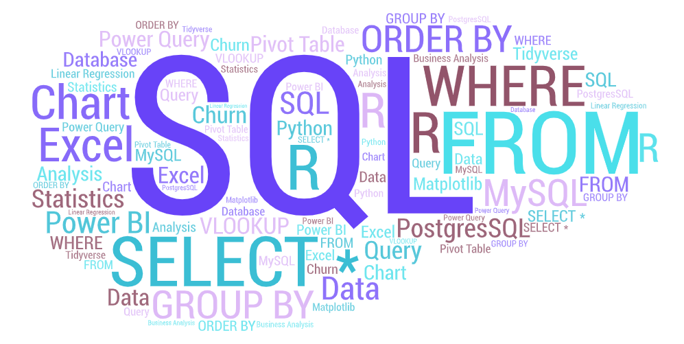

<h1 align="center">Hello there 👋, I'm William</h1>

<h1 align="center">Follow me on my <em><b>Data Analytics</b></em> journey</h1>

  

- 🔭 I’m currently working on [DNA Testing Analytics](https://github.com/wafrizzell/ancestry_python)

- 🌱 I’m currently learning **Power BI | Tableau | Pandas**

- 💬 Ask me about **Using SQL and Excel to analyze DNA testing data**

 
<h3 align="left">Connect with me:</h3>

<!-- Find good social media icons. Eventually add Kaggle, Tableau, and possibly Medium. Possibly link to my own site. -->

 
<h3 align="left">Languages and Tools:</h3>

    
    
    
    
    
    
    
    
    
    

 
<h3 align="left">Database Tools and Technologies:</h3>

<!--  -->

 
 

<!--
    Unused apps and icons, set aside for future use

    Top Language Gadget
    

    Social Media Icons
    

    Languages and Tools

    Database Tools and Technologies
     
-->
